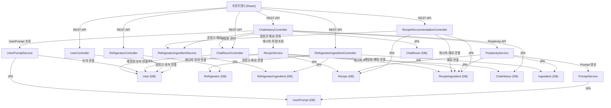

# 🗺️ 서비스 전체 구조 및 연결 설명

## 1. 전체 아키텍처 개요
- **프론트엔드(React)**: REST API를 통해 백엔드와 통신
- **백엔드(Spring Boot)**: 다양한 Controller/Service/Repository 계층으로 구성
- **DB(MySQL/기타)**: 엔티티별 테이블로 데이터 저장
- **외부 API**: Perplexity API 등

## 2. 주요 연결 다이어그램

## 3. 주요 API/서비스/DB 연결 설명

- **UserController**: 사용자 등록/조회/수정, User 테이블과 연결
- **RefrigeratorController**: 냉장고 생성/조회/수정, Refrigerator 테이블과 연결
- **RefrigeratorIngredientController**: 냉장고별 재료 관리, RefrigeratorIngredient/Ingredient 테이블과 연결
- **RecipeRecommendationController**: 레시피 추천(Perplexity API 연동 포함), Recipe/RecipeIngredient/냉장고 재료 서비스와 연결
- **ChatHistoryController**: 채팅 메시지 기록/조회, ChatHistory/ChatRoom/레시피/프롬프트 등 다양한 서비스와 연결
- **PerplexityService**: AI 레시피 추천, PromptService와 협업, DB 저장
- **PromptService**: 사용자 프롬프트(개인화 정보) 생성, UserPrompt 테이블과 연결
- **RefrigeratorIngredientService**: 냉장고 재료 조회/가공, RefrigeratorIngredient 테이블과 연결
- **RecipeService**: 레시피 저장/조회/가공, Recipe/RecipeIngredient/UserRecipe 등과 연결
- **UserPromptService**: 사용자 프롬프트 관리, UserPrompt 테이블과 연결
- **ChatRoomController**: 채팅방 생성/조회, ChatRoom 테이블과 연결

## 4. 데이터 흐름 예시
- 사용자가 채팅 메시지(프롬프트)와 refrigeratorId를 보내면 → ChatHistoryController → ChatHistoryService → (냉장고 재료 조회) → PerplexityService → AI 추천 → 결과 저장 및 반환

---

이 문서를 참고하면 전체 서비스 구조와 각 API/DB/서비스의 연결 관계를 한눈에 파악할 수 있습니다. 